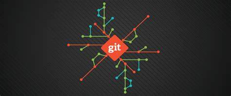

**Materi Git**

*GIT* adalah sebuah version control system yang telah digunakan oleh para developer untuk dapat mengembangkan software secara bersamaan. 

*Fungsi utama* dari GIT adalah mengatur versi source code program dengan memberikan tanda baris serta code mana yang perlu ditambah ataupun diganti.

**Perintah Dasar GIT**

Untuk dapat mengetahui bagaimana cara menggunakan GIT, berikut ini beberapa perintah dasar dari GIT. 

- GIT init ini untuk membuat sebuah repository yang berada pada file lokal dimana nantinya file tersebut bernama .git. 
- GIT status ini untuk mengetahui status dari sebuah repository lokal. 
- GIT add ini untuk menambahkan file baru yang ada pada repository yang telah dipilih. 
- GIT commit ini untuk menyimpan perubahan yang telah dilakukan. 
- GIT push ini digunakan untuk mengirimkan perubahan file setelah di commit ke remote repository. 
- GIT branch ini melihat seluruh branch yang ada dalam repository. 
- GIT checkout ini dapat menukar branch yang aktif dengan branch yang telah dipilih. 
- GIT merge ini untuk menggabungkan branch yang aktif dan yang telah dipilih. 
- GIT clone ini dapat membuat salinan repository lokal. 

**Berikut fitur-fitur yang ada pada GIT:**

1. Version control system yang terdistribusi 

GIT ini menggunakan pendekatan peer to peer, dimana tidak seperti Subversion atau SVN dimana menggunakan model client server. 

2. GIT memungkinkan developer untuk memiliki branch kode 

GIT disini memungkinkan para developer memiliki branch kode yang independent dan juga massive. 

Membuat, menghapus dan juga menggabungkan branch menjadi lebih cepat, lancar serta tidak membutuhkan waktu lama. 

3. GIT bersifat atomic 

Bersifat atomic merupakan sebuah tindakan yang akan benar-benar diselesaikan dengan lengkap atau bisa juga sama sekali gagal. 

Hal ini akan sangat penting karena pada beberapa version control system seperti CVS operasinya bersifat non atomic. 

Bila ada operasi yang tergantung dan terkait dengan repository maka kondisi repository akan menjadi tidak stabil. 

4. Media penyimpanan GIT berada dalam folder .git

Berbeda dari VCS lain seperti CVS dan atau SVN dimana metadata file disimpan dalam folder yang tersembunyi seperti .svn, .cvs, dan juga .etc. 

5. GIT memiliki data model 

GIT ini memiliki data model yang bisa membantu memastikan integritas cryptographic yang berada di dalam repository. 

Sehingga pada setiap kali sebuah file ditambahkan ataupun di commit, checksum nya akan diciptakan sama seperti retrieve melalui checksum nya juga. 

6. GIT memiliki staging area atau index 

Dengan adanya stagin area ini, para developer dapat memformat commit serta dapat membuatnya dapat di review sebelum benar diterapkan. 

7. GIT sederhana dalam penggunaannya 

Untuk dapat memulai Anda dapat membuat repository ataupun men checkout yang telah ada. 

#

**--Materi Html--**

**Apa itu HTML?**  
*Hypertext Markup Language* atau HTML adalah bahasa markup yang digunakan untuk membuat sebuah halaman web. Isinya terdiri dari berbagai kode yang dapat menyusun struktur suatu website.

HTML terdiri dari kombinasi teks dan simbol yang disimpan dalam sebuah file. Dalam membuat file HTML, terdapat standar atau format khusus yang harus diikuti. Format tersebut telah tertuang dalam standar kode internasional atau ASCII (American Standard Code for Information Interchange). 
Mengenal Tag HTML, Elemen, dan Atribut 
Setelah mengetahui bagaimana sejarah dari HTML, sekarang Anda perlu tahu komponen-komponen yang terdapat pada HTML. 

Secara umum HTML terdiri dari Tag, Elemen, dan Atribut. 

 Syntax | Description |
| ----------- | ----------- |
| html | Tag untuk membuat sebuah dokumen HTML |
| title |	Tag untuk membuat judul dari sebuah halaman |
| body |	Tag untuk membuat tubuh dari sebuah halaman |
| h1 to h6 |	Tag untuk membuat heading |
| p |	Tag untuk membuat paragraf |
| br |	Memasukan satu baris putus |
| hr |	Tag untuk membuat perubahan dasar kata didalam isi |
| !--...-- |	Tag untuk membuat komentar | Text |

untuk penjelasan tag - tag html lebih jelasnya dapat di akses [HTML](https://gilacoding.com/read/tag-tag-pada-html-beserta-fungsinya)
#
**--CSS--**

CSS adalah singkatan dari cascading style sheets, yaitu bahasa yang digunakan untuk menentukan tampilan dan format halaman website. Dengan CSS, Anda bisa mengatur jenis font, warna tulisan, dan latar belakang halaman. CSS digunakan bersama dengan bahasa markup, seperti HTML dan XML untuk membangun sebuah website yang menarik dan memiliki fungsi yang berjalan baik.CSS juga berguna untuk mengatasi keterbatasan HTML dalam mengatur format halaman website.

**Contoh CSS**

    body {
    background-color: lightblue;
    }
    h1 {
    color: white;
    text-align: center;
    }
     p 
    {
    font-family: verdana;
    font-size: 20px;
    }

untuk penjelasan css lebih jelasnya dapat di akses [CSS](hhttps://www.w3schools.com/css/css_syntax.asp)
#
**--ALGORITMA--**

Saat ini saya diberi kesempatan untuk meringkas/merangkum materi teori algoritma yang bertemakan tentang :

1. Algoritma
2. Pseudocode
3. Tipe Data
4. Variabel
5. Struktur Dasar Algoritma (Runtunan, Pengulangan, dan Seleksi)
6. Bagian-Bagian Algoritma (Judul, Deklarasi, dan Deskripsi)
7. Array 1 Dimensi
8. Array 2 Dimensi
9. Sub Program (Prosedur dan Fungsi)

Pertama-tama saya akan menjelaskan sedikit tentang :

1. Algoritma

Definisi Algoritma :

Algoritma adalah urutan langkah-langkah logis penyelesaian masalah yang disusun secara sistematis dan logis. Kata Logis merupakan kata kunci dalam Algoritma. Langkah-langkah dalam Algoritma harus logis dan harus dapat ditentukan bernilai salah atau benar.

Ciri-ciri penting dalam algoritma

- Algoritma harus berhenti setelah mengerjakan sejumlah langkah terbatas.
- Setiap langkah harus didefinisikan dengan tepat dan tidak berarti-dua (Ambiguitas).
- Algoritma memiliki nol atau lebih masukkan.
- Algoritma memiliki nol atau lebih keluaran.
- Algoritma harus efektif (setiap langkah harus sederhana sehingga dapat dikerjakan 
  dalam waktu yang masuk akal).

REFERENSI :
http://www.google.com/teknologi.kompasiana.com/definisi-algoritma

2. Pseudocode

Pseudocode adalah deskripsi dari algoritma pemrograman komputer yang menggunakan struktur sederhana dari beberapa bahasa pemograman tetapi bahasa tersebut hanya ditujukan agar dapat dibaca manusia. Biasanya yang ditulis dari pseudocode adalah variabel dan fungsi. Tujuan penggunaan utama dari pseudocode adalah untuk memudahkan manusia dalam memahami prinsip-prinsip dari suatu algoritma. Penggunaan pseudocode umumnya banyak kita temukan di buku-buku dan artikel-artikel tentang pemrograman yang membahas tentang algoritma tertentu. Kadang pula pseudocode kita temukan dalam merencanakan pengembangan suatu program komputer. Dalam pseudocode, tidak ada syntax standar yang resmi. Karena itu, pseudocode ini dapat kita terapkan dalam berbagai bahasa pemograman. Tentu saja harus kita sesuaikan setiap tahap dengan bahasa pemograman yang kita gunakan. Fungsi dari pseudocode mungkin sama dengan Flowchart. Perbedaannya terletak pada cara penyampaiannya. Pseudocode menggunakan kata-kata untuk menjelaskan suatu algoritma, sedangkan Flowchart menggunakan gambar.

REFERENSI :
http://tamam-prolinx.blogspot.com/2009/03/pseudocode-dan-flowchart.html

3. Tipe Data

Dalam algoritma, kita harus bisa menentukan tipe-tipe data yang sesuai digunakan dalam Penyelesaian masalah. Sehingga komputer dapat mengolah dan mendapatkan hasil yang sesuai Menurut kebutuhan data.

Ada beberapa tipe data yang harus kita ketahui antara lain :

1. Tipe data Char dan String
Ini merupakan tipe data dasar, tipe data ini didefinisikan pada deklarsi var dibagian algoritma/program.

    Contoh:

        Var Nama : String
        Nilai : Char   

Keterangan :
* Nama merupakan sebuah variabel didefinisikan sebagai variabel bertipe string, maksudnya Pada variabel tersebut digunakan untuk menerima masukan sebuah nama yang terdiri dari Sekumpulan huruf, dapat berupa huruf besar, kecil, atau campuran kedua-duanya.
* Nilai, didefinisikan sebagai variabel yang bertipe data char, maksudnya variabel tersebut Hanya dapat digunakan untuk memasukkan sebuah huruf dari huruf besar, seperti A, B, C,.. atau huruf kecil, a, b, c.

2. Tipe Data Integer
Merupakan tipe data bilangan bulat.
Contoh:
Byte 0…255 1 byte
Word 0…65.555 1 byte
Integer -32.768 s.d 32.767 2 byte
Long Integer -2.147.483.648 4 byte

REFERENSI :
http://hilmihalma.blogspot.com/2011/01/tipe-data-dalam-algoritma.html

 4. Variabel

Tipe variabel menentukan nilai yang dapat disimpan variabel tersebut dan operator-operator apa yang dapat dikenakan padanya. Sebagai contoh, tipe integer hanya dapat menyimpan bilangan integer dan operator yang dapat dikenakan padanya antara lain operator penjumlahan, perkalian, dan sebagainya.

contoh variabel :

1. Bilangan/Numerik
Bilangan/Numerik dibagi menjadi dua yaitu bilangan bulat/numerik dan bilangan real/pecahan.
* Bilangan bulat memiliki 2 tipe yaitu Integer dan Long
* Bilangan real memiliki 2 tipe yaitu Single dan Double

2. Karakter / String
String adalah semua karakter yang ada dalam tabel ASCII, contoh : ‘a’…’z’…’0′…’9′. Operasi yang bisa dilakukan hanya operasi perbandingan saja. Tipe String ialah gabungan dari karakter, tipe string bisa digunakan untuk menyimpan data yang berupa untaian karakter.

REFERENSI :
http://johnnyocean.wordpress.com/

5. Struktur Dasar Algoritma (Runtunan, Pengulangan, dan Seleksi)

    1. Runtunan(Sequence)
    2. Seleksi(Selection)
    3.Pengulangan( Repetition)

        1. Runtunan(Sequence)
      -Sebuah runtutan terdiri dari satu atau lebih intruksi.
      -Intruksi dilaksanakan setelah intruksi sebelumnya dilaksanakan.
      -Urutan intruksi menentukan keadaan akhir algoritma.
              1 2 3 4
              A1 A2 A3 A4

        2. Seleksi(Selection)
        Adakalanya sebuah instruksi dikerjakan jika kondisi tertentu dipenuhi. Tiap–tiap  
        instruksi akan diseleksi oleh kondisi, apabila instruksi memenuhi kondisi yang
        diminta, maka instruksi akan dijalankan.

        3.Pengulangan( Repetition)
        Kondisi yang dilaksanakan secara berulang-ulang.
        Contohnya :
        1. For
        2. While
        3. Do....While

REFERENSI :
yusufhdc.edublogs.org/files/2010/01/Struktur-Dasar-Algoritma

6. Bagian-Bagian Algoritma (Judul, Deklarasi, dan Deskripsi)

Algoritma disusun oleh 3 bagian (blok) yang biasanya selalu ada dalam sebuah algoritma. 3 bagian itu adalah :

1.      bagian judul (header)
2.      bagian deklarasi (declaration)
3.      bagian deskripsi(description)

Ketiga bagian tersebut secara umum ditunjukkan dalam notasi algoritmik seperti di bawah.

PROGRAM nama program
{berisi judul algoritma, singkat dan jelas}

DEKLARASI
{sebagai tempat untuk mengenalkan nama atau variabel apa saja yang digunakan dan tipe datanya serta prosedur dan fungsi yang dipakai}

ALGORITMA :
{berisi langkah-langkah penyelesaian masalah}

REFERENSI :
http://www.amazinglight.info/struktur-dasar-algoritma.html

7. Array 1 Dimensi

Array merupakan kumpulan dari nilai-nilai data yang bertipe sama dalam urutan tertentu yang menggunakan nama yang sama. Dengan menggunakan array, sejumlah variabel dapat memakai nama yang sama. Letak atau posisi dari elemen array ditunjukkan oleh suatu index.

Bentuk Umum pendeklarasian array :

Contoh :
int nil[5];
Nilai suatu variabel array dapat juga diinisialisasi secara langsung pada saat
deklarasi, misalnya:
int nil[5] = { 1,3,6,12,24 };
Maka di penyimpanan ke dalam array dapat digambarkan sebagai berikut:

contoh program :
    
    #include <iostream.h>
    #include <conio.h>
    void main()
    {
    //inisialisasi array
    // int ujian[5]= {90,95,78,85};
    int ujian[5];
    //input data ke array
    for (int k=0;k<5;k++)
    {
    cout<<"masukkan data nilai ujian["<<k<<"] = ";
    cin>>ujian[k];
    }
    //tampil data array
    for (int j=0;j<5;j++)
    {
    cout<<"data nilai ujian["<<j<<"] = "<<ujian[j]<<endl;
    }
    getch();
    }

REFERENSI :
http://allaboutalgoritma.blogspot.com/

8. Array 2 Dimensi

Pada bagian ini, ditunjukkan array berdimensi lebih dari satu, yang sering disebut dengan array berdimensi dua. Sering kali digambarkan/dianalogikan sebagai sebuah matriks. dimana indeks pertama menunjukan baris dan indeks kedua menunjukan kolom
ILUSTRASI ARRAY 2 DIMENSI
Gambar array berdimensi (baris x kolom = 3 x 4):

contoh program :
    
    #include <iostream.h>
    #include <conio.h>
    void main()
    {
    int matrix[3][4] = {{5,10,1,11},{4,7,67,-9},{9,0,45,3}};
    for (int i = 0; i<3; i++)
    {
    for (int j=0;j<4; j++)
    {
    cout<<matrix[i][j]<<" ";
    }
    cout<<endl;
    }
    getch();
    }

REFERENSI :
http://allaboutalgoritma.blogspot.com/

9. Sub Program (Prosedur dan Fungsi)

Sub Algoritma adalah sebuah algoritma pendek yang ditulis terpisah dari Algoritma utama, dimana setiap saat dibutuhkan dapat dipanggil tanpa menulis ulang. Dalam pembuatan program Sub Algoritma disebut juga dengan Sub Program.
Keuntungan lain dari Sub Program adalah bila dalam sebuah program terdapat proses tertentu yang sering digunakan dalam program, maka dengan adanya sub algoritma kita tidak perlu menuliskan proses tersebut berulang ulang, cukup memanggil sub program yang sudah disiapkan.
Bentuk Sub Program dapat berupa sebuah Prosedur ataupun Fungsi, dan dalam setiap Prosedur atau Fungsi tersebut dapat dilewatkan sebuah Parameter agar Prosedur/ Fungsi tersebut mampu menerima inputan dari program utama.

Jenis Sub Program dalam Algoritma :

1.   PROCEDURE

Procedure adalah sebuah sub program yang dapat dipanggil sewaktu – waktu jika diperlukan oleh program utama. Sebuah procedure dapat dipanggil langsung oleh program utama ataupun dipanggil berdasarkan kondisi-kondisi tertentu. Sebuah procedure biasa tidak dapat menerima masukan dari program utama, jadi hanya dapat dipanggil saja. Jadi semua blok program yang diperlukan (dari input, proses, sampai output) harus diletakkan pada procedure, dan program utama hanya bertugas memanggil saja jika diperlukan.

Cara mendeklarasikan sebuah fungsi adalah sebagai berikut :
    
    procedure A; { nama prosedur adalah A }
    begin
    { statement }
    end;

 PARAMETER

Perlu diingat bahwa sebuah prosedur biasa tidak bisa menerima inputan nilai dari program utama (hanya bisa dipanggil saat diperlukan). Tetapi sebuah prosedur akan bisa menerima inputan dari program utama jika dilengkapi dengan sebuah PARAMETER. Parameter adalah variabel dalam sebuah prosedur atau fungsi yang gunanya untuk menampung nilai yang dikirimkan oleh program yang memanggil prosedur atau fungsi tersebut.
PARAMETER dideklarasikan setelah nama prosedur, diikuti dengan jenis variabelnya.

Contoh :
PROCEDURE satu(n_akhir:integer);

2.   FUNCTION (FUNGSI)

Function hampir sama dengan prosedur, bedanya function hanya menghasilkan satu nilai output, dan sebuah function bisa mengembalikan nilai output yang dihasilkannya tersebut ke program utama(pemanggilnya).

Cara mendeklarasikan sebuah fungsi adalah sebagai berikut :

    function A : integer; { nama fungsi adalah A dengan }
    begin { tipe data keluaran adalah integer }
    { statement }
    A := 3; 
    { nilai yang dikeluarkan fungsi }
    end;

REFERENSI :
       http://soalmu.wordpress.com/

